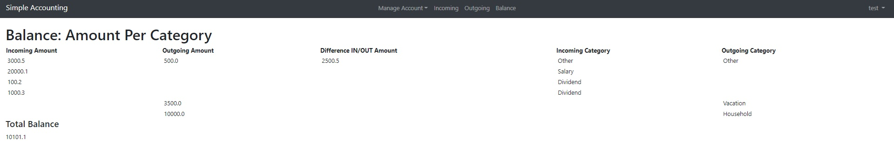

# Work in progress

# Simple Accounting
* With the help of this accounting application user has possibility to manage his budget / finances.

Images

# Educational goal
 * learn how to design and develop simple and functional application by using an Web Framework (Web2py)
 * learn how to structure code in a modular way combining with OOP technics

# Focus on
 * creation of good quality code
 * code which is not understandable, should be refactored until this is understandable
 * solve problem by produsing less code as possible

# Requirements
Create simple accounting application for managing incoming and outgoing finances.
* User should be able create his own personalized account.
* The base structure should consist of incoming, outgoing and balance parts.
* Incoming: In the incoming part user has possibility to enter and view required data.
* Outgoing: In the outgoing part user has possibility to enter and view required data.
* Balance: In the balance part should view difference of total amount between incoming and outgoing parts.
  balance = SUM(incoming amount) – SUM(outgoing amount)
* Implement Pie Chart in to Incoming and Outgoing sections

# Dependencies
  * web2py web framework (used python 3.6)
  * bokeh v.2.0.2

# Installation
* 1. download source code of web2py framework to the local machine
* 2. unzip web2py source code to your dev folder
* 3. create via web2py admin interface new application called "accounting"
* 4. copy repositories code applications/accounting in to ../web2py/applications/accounting

# Configuration

# Why this code is published?
* Author publishes this code purely for private educational / exercise purposes
* Author allows viewing and reviewing his code
* Author forbids any commercialuse of this code,
 since this code was published only for private educational / exercise purposes

TODO improve readme file :)